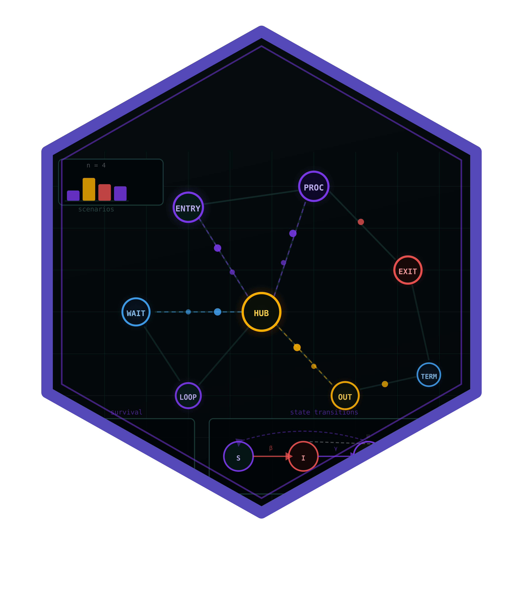

# dynasimR — Dynamic Agent-Node Simulation Analysis 

<!-- badges: start -->
[](https://github.com/r-heller/dynasimR/actions/workflows/R-CMD-check.yaml)
[](https://r-heller.github.io/dynasimR/)
[](https://CRAN.R-project.org/package=dynasimR)
[](https://app.codecov.io/gh/r-heller/dynasimR?branch=main)
[](https://cran.r-project.org/package=dynasimR)
[](https://cran.r-project.org/package=dynasimR)
[](https://opensource.org/licenses/MIT)
[](https://lifecycle.r-lib.org/articles/stages.html#experimental)
<!-- badges: end -->

A domain-neutral analysis and visualisation layer for discrete-event,
agent-based and node-actor simulation outputs. The package is
schema-harmonised so that two output profiles (**Profile A** and
**Profile B**) can be analysed with a single API.

Typical use cases include any system in which entities (actors, nodes,
agents) move through states and interact within spatial or network
environments — for example flow analyses, state-transition studies,
resource allocation and policy comparisons.

## Installation

```r
# install.packages("remotes")
remotes::install_github("cttir/dynasimR")
```

## Quick start

```r
library(dynasimR)

# 1. Load bundled example data (or point to your own simulation outputs)
sim <- load_example_data()
# sim <- read_simulation("~/my-simulation/data/raw/")

# 2. Time-to-event analysis
km <- km_estimate(sim, endpoint = "stage2", stratify_by = "scenario")
plot_km(km, title = "Time-to-stage-2")

# 3. Policy effect (policy A vs. policy B)
pol <- policy_effect(sim, policy_a_scenario = "A-S08",
                     policy_b_scenario = "A-S07")
cat(pol$narrative)   # ready to drop into a report

# 4. Autonomy-level trade-off
al <- al_efficiency(sim)
plot_al_tradeoff(al)

# 5. Manuscript export
export_latex_table(
  data     = pol$effect_sizes,
  filename = "policy_table.tex",
  caption  = "Policy effect sizes.",
  label    = "policy"
)

# 6. Interactive Shiny dashboard
launch_app()
```

## Feature map

| Analysis goal                         | Key function                  |
|---------------------------------------|-------------------------------|
| Entity flow through processing stages | `stage_throughput()`          |
| Time-to-event stratified by scenario  | `km_estimate()`, `cox_model()`|
| Policy A vs. policy B comparison      | `policy_effect()`             |
| Autonomy-level trade-off (AL0-AL5)    | `al_efficiency()`             |
| Compliance Index                      | `compute_compliance_index()`  |
| Profile B progress trajectory         | `progress_trajectory()`       |
| Profile B wait-gap index              | `compute_wait_gap_index()`    |
| Manuscript placeholder fill           | `fill_placeholders()`         |

## Requirements

- R >= 4.1.0 (base pipe `|>` used throughout)
- Required imports: dplyr, tidyr, purrr, readr, tibble, ggplot2,
  survival, rlang, cli, glue
- Shiny app requires the `Suggests:` dependencies — install with
  `dynasimR::check_app_dependencies()`

## Use of LLM tools

Portions of this package were prepared with assistance from large language model tooling for
narrowly defined, non-authorial tasks: copyediting, prose smoothing, Markdown/LaTeX formatting,
scaffolding of boilerplate files (CI configs, build scripts), code refactoring. The tools used were [Chat AI](https://kisski.gwdg.de/leistungen/2-02-llm-service/),
the LLM service of KISSKI (GWDG), and a self-hosted **Mistral Small (24B, Apache-2.0)** run locally via
[Ollama](https://ollama.com/) and the `ollamar` R package — local inference only, with no data sent to
third parties for the self-hosted model.

All scientific claims, methodological choices, analyses, interpretations, and conclusions are the
author's own. No LLM-generated text was incorporated without review and revision, and every reference
was verified against its DOI, arXiv ID, or ISBN.

## License

MIT (c) R. Heller
